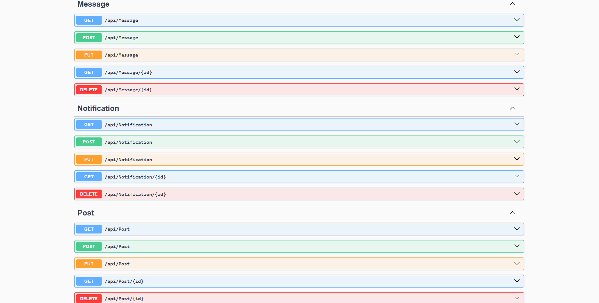

# 🌐 Social Media Api Prototype — Social Media .NET Core API

<br>

[](../../issues/new?labels=bug)
[](../../issues/new?labels=enhancement)

<br>

## 📌 Project Overview

**Social Media App Prototype** is an early-stage **.NET Core REST API** project designed with an **Instagram-inspired approach**, aiming to build a modern, scalable social media backend.  
This prototype laid the groundwork for essential features such as user management, posting, interactions, and feed logic, serving as the **foundation for the more advanced [XenoTerra API](https://github.com/Hereetria/xenoterra-api)** — the professional, production-level version of this concept.

The goal of this project is to explore **clean architecture**, proper layering, and reusable patterns for future social media platforms.

<br>

## ✨ Features

- 👤 **User Management** — Authentication and profile handling  
- 📝 **Post System** — Create and manage posts  
- ❤️ **Interactions** — Likes, comments, and basic engagement  
- 🧭 **Feed Structure** — Instagram-like content delivery logic  
- 🧱 **Layered Architecture** — Clean separation of concerns with repository & service layers  
- 🧼 **Maintainable Codebase** — Built with clean code principles as a prototype for future scaling

<br>


## 🖼️ Screenshots

> Example endpoints and structures (Swagger UI or Postman)

<p align="center">
  
  
  
</p>

<br>

## 🧰 Tech Stack

<p>
  
  
  
</p>

<br>

## 📥 Installation

### Prerequisites
- .NET SDK 7.0+  
- SQL Server (local or remote)

### Setup
```bash
git clone https://github.com/Hereetria/socialmedia-app-prototype.git
cd socialmedia-app-prototype

dotnet restore
dotnet ef database update   # Apply migrations
dotnet run
```

The API will run on `https://localhost:5001` by default.  
You can explore and test endpoints using Swagger UI.

<br>

## 📜 License

[](LICENSE)

This project is licensed under the terms described in the [LICENSE](./LICENSE) file.

---

© 2025 Yusuf Okan Sirkeci — [Hereetria](https://github.com/Hereetria)
